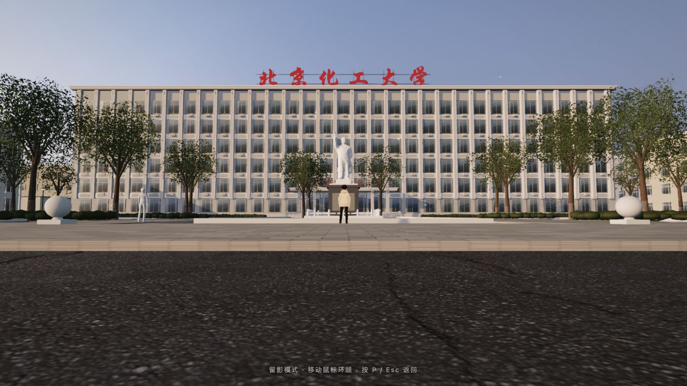

# 又见北化 · BUCT Dream

**北三环的风，吹过熟悉的树梢。**  
*A golden-hour return to a campus you remember.*

[中文](#中文) · [English](#english) · [操作 / Controls](#操作--controls) · [素材 / Credits](#素材与许可--credits--licenses)

*游戏实机截图 · Captured in the playable scene*

## 中文

这里是北京化工大学东校区，北三环旁边的那片校园。

夕阳停在日落之前，树影落在熟悉的道路上，空气中有轻轻浮动的光点。你可以跑过主教楼，穿过母校之光旁的花园和紫藤长廊，走到逸夫图书馆、操场和烛光超市。也可以踩上一柄剑，沿着视线飞起来，再落到屋顶上看看校园。

**[→ 直接试玩，无需下载](https://guigulaoshi.github.io/buct-dream/)**

- **自由漫游**：第三人称跑步、慢走、鼠标转向和镜头缩放。
- **永恒的金色傍晚**：固定夕阳、树影、漂浮光点，以及可选的风声、蝉鸣、虫鸣和鸟叫。
- **校园里的一点回声**：灰模同学和校友在路上走动，按 F 听一句话，读一块告示牌。
- **御剑飞行**：剑尖跟随飞行方向，支持爬升、俯冲、加速和屋顶落地；收剑后可以继续跑动。
- **随时留影**：按 P 隐藏主要界面，按 M 查看校园示意图。

这是一个关于记忆与重返的校园漫游作品。建筑外观和布局参考公开校园地图、照片与校友回忆，未核实的细节作了近似补全。**它不是测绘模型，也不是学校官方项目；不隶属于《原神》或其开发商。** 建筑内部不开放，人物对白和告示内容含创作。

## English

**BUCT Dream** is a third-person browser experience inspired by Beijing University of Chemical Technology’s East Campus, beside Beijing’s North Third Ring Road.

The sun stays just above the horizon. Trees cast long shadows, small lights drift through the air, and familiar paths lead past the main teaching building, the campus garden, the vine-covered pergola and Yifu Library. Wander without a quest, exchange a line with a passing alumnus, or ride a sword above the rooftops.

**[→ Play in your browser](https://guigulaoshi.github.io/buct-dream/)**

Explore on foot, switch between running and walking, hear optional summer ambience, and use sword flight to climb, dive and land on rooftops. The sword and rider turn together; collecting the sword lets the character drop and resume walking. A map and photo mode are included.

This is an artistic reconstruction informed by public maps, photographs and alumni recollections—not a surveyed digital twin or an official university product. It is not affiliated with Genshin Impact or its developer. Some details are approximations; dialogue and notices include fictional writing. Building interiors are closed.

## 操作 / Controls

| 按键 / Input | 功能 / Action |
| :--- | :--- |
| 点击画面 / Click the scene | 锁定鼠标，开始转向 / Capture the mouse to look around |
| 鼠标移动 / Mouse movement | 转动视角；御剑时控制朝向 / Look around; steer during flight |
| W A S D / 方向键 / Arrow keys | 跑步 / Run |
| Shift | 地面慢走；御剑加速 / Walk on foot; boost in flight |
| R | 起飞 / 收剑直落，可落屋顶 / Take off or collect the sword and drop onto ground or rooftops |
| 御剑 W · A/D · S / In flight | 沿视线前飞 · 横移 · 刹车 / Fly toward your view · move sideways · brake |
| F | 与 NPC、告示和物件互动 / Interact with people, notices and objects |
| 滚轮 / Mouse wheel | 镜头远近 / Camera distance |
| M / P | 地图 / 留影模式 · Map / Photo mode |
| Esc | 释放鼠标，关闭弹窗 / Release the mouse, close dialogs |
| 右上角 ♪ / Top-right ♪ | 开关环境声音 / Toggle ambient audio |

> 浏览器需要一次点击才能锁定鼠标。环境声音默认关闭，可自行打开。  
> Browsers require a click before capturing the mouse. Ambient audio is off until enabled.

## 运行要求 / Requirements

桌面浏览器、键盘和鼠标，支持 WebGL 2，建议开启硬件加速。首次打开需加载模型和贴图，请等待载入完成。移动端操作尚未适配。

Use a desktop browser with WebGL 2, a keyboard and a mouse. Hardware acceleration is recommended. Allow time for models and textures to load on the first visit. Touch controls are not currently supported.

## 素材与许可 / Credits & licenses

完整署名见 **[dist/credits.txt](dist/credits.txt)** 和 **[THIRD_PARTY_NOTICES.md](THIRD_PARTY_NOTICES.md)**。

| 来源 / Source | 用途 / Use |
| :--- | :--- |
| [Three.js](https://threejs.org/) · [three-vrm](https://github.com/pixiv/three-vrm) | 3D 渲染与角色运行时 / Rendering and character runtime · MIT |
| [Poly Haven](https://polyhaven.com/) | 地面贴图、树木与夕阳环境 / Ground textures, trees and sunset environment · CC0 |
| VRoid Project · [Quaternius](https://quaternius.com/packs/universalbasecharacters.html) | 人物与 NPC 发型 / Characters and NPC hairstyles · CC0 |
| [VVayToyek](https://vvaytoyek.itch.io/chinese-sword-pack-1-free) | 中式剑模型 / Chinese sword model · CC0 |
| [CMU Motion Capture](https://mocap.cs.cmu.edu/search.php?subjectnumber=134) | 滑板滑行与落地动作 / Skateboard glide and landing motion |
| [Moøkan](https://sketchfab.com/3d-models/mao-zhedong-7adef70c9e5c46c38da5b6c4c52e7995) | 雕像替代扫描模型 / Substitute statue scan · CC BY 4.0 |
| [OpenStreetMap contributors](https://www.openstreetmap.org/copyright) | 部分建筑轮廓参考 / Selected building-footprint references · ODbL |

第三方资源保留各自许可。角色步行/跑步动作仅作为本游戏的一部分使用，不作为独立动作素材包提供。公开可见不代表所有文件具有同一开源许可；原创代码目前未另行授予开源许可。  
Third-party resources retain their respective licenses. Walk/run animation data is included for use in this game, not as a standalone animation pack. Public visibility does not place every file under a single open-source license; no separate open-source license has been granted for the original code.

---

**阳光还在，路也还在。**  
*The light is still here. So are the paths.*

[走回校园 / Take the way back →](https://guigulaoshi.github.io/buct-dream/)

